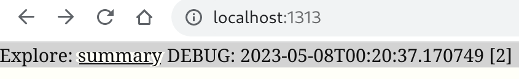

title: Live dirt server preview guide

For fast and accurate editing of markdown content, use the dirt server command.

In your directory where the `content/` directory is located,
type the following command:  (NOTE: the '$' is the prompt, don't type that)

    $ dirt server 
	Serving http://localhost:1313 ...

This command quickly builds your web content in the `public/` directory
and then starts a local web server on port 1313 so you can browse
by typing the URL (`[http://localhost:1313](http://localhost:1313)`)
into your browser. 
You can specify the port number by specifying, for example, `-p 12345`
on the command line.

## Live updates

The dirt local server also observes the `content/` directory for changes,
and when markdown files are changed it quickly rebuilds the web files again.
This means you can browse to a webpage, edit the markdown that defines it,
and when you hit save see it refresh 
(within a couple of seconds) with the new changes visible.

## Explore bar

At the top of locally served pages only (that is, never on the website itself)
you will see a light gray bar.

(FYI: The DEBUG portion is a temporary debugging hack that shows the timestamp
of the most recent rebuild used to make the automatic refresh work.)

You can click the "summary" link to get to an index of several useful pages:

* Site config: a listing of site configuration parameters from _config.toml
* Site map: a listing of all webpages of the site for review or quick access
* RSS Feeds: links to RSS feeds if any are defined
* Links: summary counts of links in the site and listing of external links

The Links page is useful debugging problems that `dirt check` command flags.

